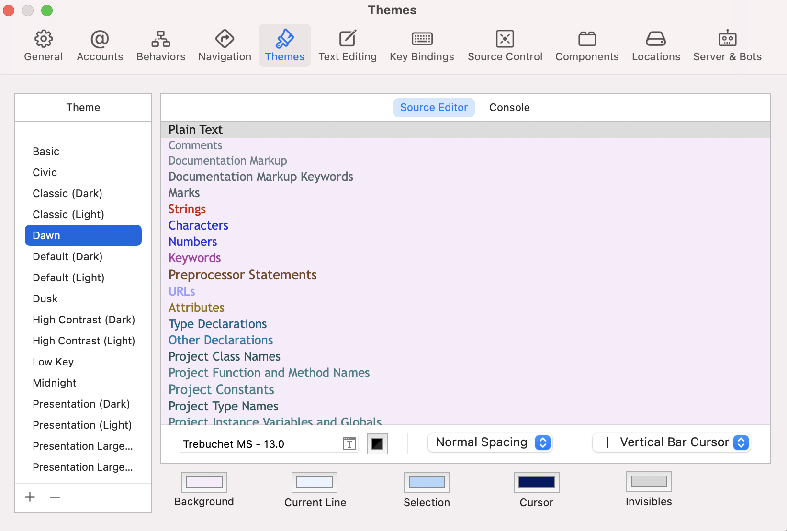
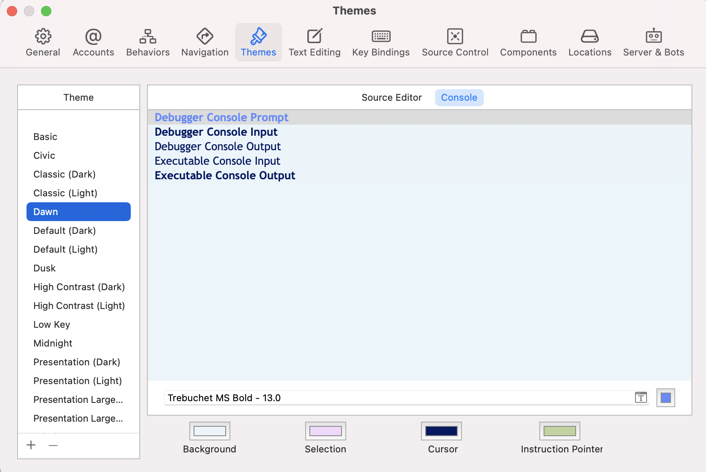

# What is `.xccolortheme` file?

`.xccolortheme` is `XCode COLOR THEME` file

- This is the color-theme file used by Apple's Xcode, an IDE used to develop iOS and Mac OS X applications; contains data that describes the color theme of the code editor; includes the text color, text font, and text background color of different elements of source code editing, such as Plain Text, Strings, URLs, Attributes, and Comments.
- It's preferred to use Xcode to open `xccolortheme` file extensions.
- The theme files are in XML format with colors stored as RGBA values in a string
e.g.
```
...
    <key>DVTSourceTextSyntaxColors</key>
<dict>
    <key>xcode.syntax.attribute</key>
    <string>0.512 0.423 0.157 1</string>
...
```


# 🎨 Custom `Xcode` theme - Dawn

This repository contains a sample the `Xcode` color & font theme for Dawn colors and steps how to create your own custom theme for `Xcode` IDE.




## Installing `Dawn.xccolortheme`

- The easiest way to install this `Xcode` theme is to download `Dawn.xccolortheme` file and place it at
```
~/Library/Developer/Xcode/UserData/FontAndColorThemes/...
```
- Now restart `Xcode`
- If the folder `FontAndColorThemes` doesn't exist, simply create one.

## Customization

If you want to create your own custom theme for `Xcode` IDE, with your choice of colors and font selection, simply copy `Dawn.xccolortheme` file and rename it with your theme name, and then edit the colors, font names with size, etc. After you're done, simply place it at the above folder location, and restart `Xcode`.

## Author
Noor ul Ain Ali (noorulain.ali89@gmail.com)
